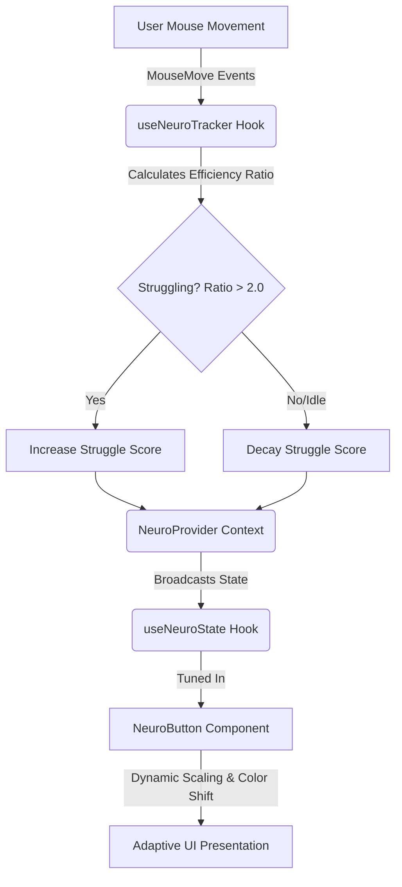

# 🧠 Neuro-Adaptive UI Engine

An intelligent, client-side, real-time adaptive user interface engine designed to enhance web accessibility. By analyzing mouse telemetry in real-time, the engine detects signs of motor impairment (e.g., tremors, coordination struggles) and dynamically scales UI components to improve targeting, clicking, and overall usability.

---

### 👤 Author & Trademark
This project is designed, created, and maintained by **Vineet M Dharwad** (VINEET M DHARWAD ™).

---

## 🚀 Overview

Static user interfaces assume standard motor skills and device precision. For users experiencing physical tremors, muscle fatigue, or motor control challenges, clicking typical-sized buttons can be difficult and frustrating.

The **Neuro-Adaptive UI Engine** solves this by:
1. **Listening** to raw pointer movements.
2. **Analyzing** the spatial efficiency of the path.
3. **Broadcasting** a real-time "struggle score" via React Context.
4. **Adapting** components (e.g., enlarging button sizes, adjusting layout spacing, and increasing visual cues) to ease interaction.

---

## 🛠️ How it Works (Under the Hood)

The core logic lies in the telemetry tracking hook (`useNeuroTracker.js`), which tracks coordinate samples and calculates movement efficiency.

### 📐 The Mathematical Model: Efficiency Ratio

Every 500ms, the tracker calculates two main values from the collected path points:
1. **Total Path Length ($L$)**: The sum of distance between all consecutive pointer samples:
   $$L = \sum_{i=1}^{N-1} \sqrt{(x_i - x_{i-1})^2 + (y_i - y_{i-1})^2}$$
2. **Net Displacement ($D$)**: The direct Euclidean distance from the first sample to the last sample in the interval:
   $$D = \sqrt{(x_{N-1} - x_0)^2 + (y_{N-1} - y_0)^2}$$

The **Efficiency Ratio ($R$)** is defined as:
$$R = \frac{L}{D + 1}$$

> **Interpretation:**
> * If a user moves their mouse in a straight, controlled line towards a target, $L \approx D$, leading to $R \approx 1$.
> * If a user struggles, showing high tremor, overshooting, or erratic path adjustments, the path length $L$ is significantly larger than the net displacement $D$, resulting in a high ratio ($R > 2.0$).

### ⚡ Telemetry & State Management

* **Trigger Condition**: If the path length is substantial ($L > 50\text{px}$) and the efficiency ratio is poor ($R > 2.0$), the **Struggle Score** increases by `+30` (capped at `100`).
* **Active Decay**: To ensure the UI returns to normal when stability is regained, a decay timer runs every 200ms, gradually decreasing the struggle score by `-5`.

---

## 📂 Architecture & File Structure

```
Neuro-Adaptive-Engine/
├── index.html            # Entry HTML file
├── package.json          # Dependency and script manager
├── vite.config.js        # Vite configuration
├── LICENSE               # MIT License file
└── src/
    ├── main.jsx          # React app mount with NeuroProvider
    ├── App.jsx           # Main layout displaying adaptive components
    ├── NeuroContext.jsx  # Context Provider and state hooks
    ├── NeuroButton.jsx   # Adaptive button adjusting to telemetry
    ├── useNeuroTracker.js# Telemetry tracker hooks containing calculations
    ├── App.css           # Global application styles
    └── index.css         # Styling baseline
```

### 📡 The Communication Loop



---

## 💻 Code Highlights

### 1. The Adaptive Context (`NeuroContext.jsx`)
Acts as a central "broadcasting tower" so that any component nested in the tree can tune in to the telemetry data without prop-drilling:

```javascript
import React, { createContext, useContext } from 'react';
import { useNeuroTracker } from './useNeuroTracker';

const NeuroContext = createContext();

export function NeuroProvider({ children }) {
    const struggleScore = useNeuroTracker();
    return (
        <NeuroContext.Provider value={struggleScore}>
            {children}
        </NeuroContext.Provider>
    );
}

export function useNeuroState() {
    return useContext(NeuroContext);
}
```

### 2. The Dynamic Adaptive Button (`NeuroButton.jsx`)
Reads the struggle score and shifts properties like `padding`, `fontSize`, `transform: scale()`, and colors to make target acquisition easier for the user:

```javascript
import React from 'react';
import { useNeuroState } from './NeuroContext';

export default function NeuroButton() {
    const struggleScore = useNeuroState();

    const dynamicStyle = {
        padding: `${10 + (struggleScore * 0.3)}px ${20 + (struggleScore * 0.5)}px`,
        fontSize: `${16 + (struggleScore * 0.15)}px`,
        backgroundColor: struggleScore > 40 ? '#28a745' : '#007bff',
        color: 'white',
        border: 'none',
        borderRadius: '8px',
        cursor: 'pointer',
        transition: 'all 0.3s ease-out',
        transform: `scale(${1 + (struggleScore * 0.002)})`,
    };

    return (
        <div style={{ textAlign: 'center', marginTop: '50px' }}>
            <p style={{ color: '#666', marginBottom: '20px' }}>
                Live System Telemetry (Struggle Score): {struggleScore}
            </p>
            <button style={dynamicStyle}>
                Complete Action
            </button>
        </div>
    );
}
```

---

## 🛠️ Installation & Running Locally

1. **Clone the repository**:
   ```bash
   git clone https://github.com/winitdwd-lgtm/Neuro-Adaptive-Engine.git
   cd Neuro-Adaptive-Engine
   ```

2. **Install dependencies**:
   ```bash
   npm install
   ```

3. **Start the development server**:
   ```bash
   npm run dev
   ```

4. **Simulate impairment**:
   * Open the app in your browser.
   * Shake your mouse cursor rapidly to simulate motor-impairment/tremor telemetry.
   * Watch the Struggle Score increase and the action button dynamically expand to assist in selection.

---

## 📄 License & Trademark

This project is created and maintained by **Vineet M Dharwad** (VINEET M DHARWAD ™).

Licensed under the **MIT License**. See the [LICENSE](LICENSE) file for details.

Copyright (c) 2026 Vineet M Dharwad
